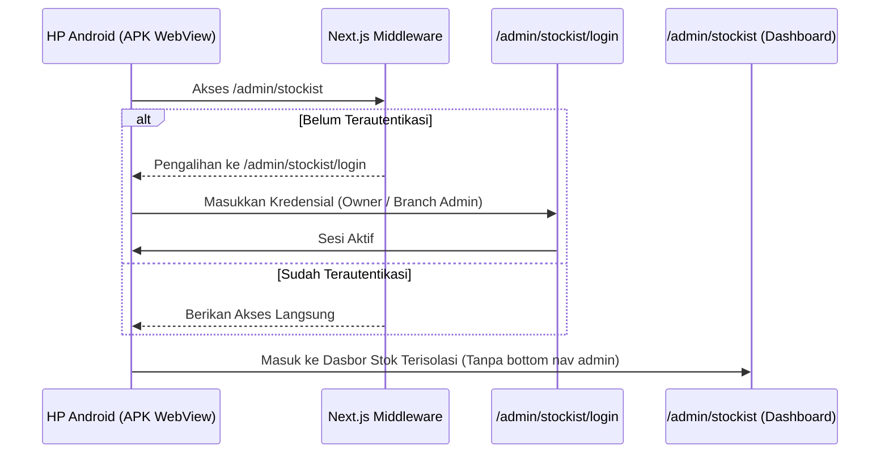

# Ringkasan Implementasi: Pembuatan Aplikasi Standalone RedBox Stockist

Dokumen ini berisi rangkuman lengkap percakapan, analisis teknis, langkah perbaikan, dan modifikasi kode yang telah dilakukan untuk memisahkan modul **RedBox Stockist** menjadi aplikasi Android standalone dengan ikon kustom.

---

## 📅 Garis Waktu & Riwayat Masalah (Problem History)

### 1. Masalah Build Awal (Android Gradle Error)
* **Masalah**: Gradle build gagal saat kompilasi APK karena dependensi eksternal membutuhkan AndroidX, sementara konfigurasi proyek belum mengaktifkannya.
* **Solusi**: Membuat/memperbarui file `gradle.properties` di akar folder proyek Android dan menambahkan:
  ```properties
  android.useAndroidX=true
  ```
  Langkah ini berhasil memperbaiki proses build (`exit code 0`).

### 2. Halaman Error 404 pada APK Android
* **Masalah**: Setelah instalasi APK di perangkat Android, WebView menampilkan halaman `404 NOT FOUND` dari Vercel.
* **Analisis**: Target URL pada WebView di file `strings.xml` mengarah ke domain backend/landing page:
  `https://redbox-barbershop.vercel.app/admin/stockist` (yang tidak melayani rute Next.js).
* **Solusi**: Mengubah target URL pada [`strings.xml`](file:///d:/Digital%20Market/Website%20RedBox/android/app/src/main/res/values/strings.xml) ke domain produksi frontend Next.js yang benar:
  `https://admin.redboxbarbershop.com/admin/stockist`

### 3. Pemisahan Alur Login (Standalone Login Page)
* **Masalah**: Saat WebView dimuat tanpa sesi aktif, pengguna dialihkan ke halaman pemilih peran Staff Portal utama (`01 Owner`, `02 Kasir`, `03 Kapster`), bukan langsung ke Stockist.
* **Solusi**:
  - Membuat halaman login mandiri khusus Stockist di [`/admin/stockist/login/page.tsx`](file:///d:/Digital%20Market/Website%20RedBox/frontend/src/app/admin/stockist/login/page.tsx) dengan tema gelap eksklusif.
  - Membatasi akses login di halaman ini hanya untuk peran `owner` dan `branch_admin`.
  - Menyesuaikan [`middleware.ts`](file:///d:/Digital%20Market/Website%20RedBox/frontend/src/middleware.ts) untuk mengarahkan kunjungan tidak sah di area `/admin/stockist/*` langsung ke halaman login Stockist mandiri ini, bukan ke beranda utama.

### 4. Pemisahan Tampilan Layout (Menghilangkan Navigasi Dashboard Admin)
* **Masalah**: Setelah berhasil masuk, aplikasi Stockist masih menampilkan bilah navigasi bawah (AdminNav) dan header dari portal admin utama karena mewarisi layout dari parent-nya (`/admin/layout.tsx`).
* **Solusi**: 
  - Melakukan restrukturisasi folder Next.js dengan membuat **Route Group** (Grup Rute) bernama **`(admin_portal)`** di dalam `src/app/admin/`.
  - Memindahkan seluruh modul admin utama (`bookings`, `customers`, `dashboard`, `barbers`, `leaderboard`, `membership`) serta file `layout.tsx` utama ke dalam grup rute `(admin_portal)`.
  - Hasilnya, rute `/admin/stockist` terbebas dari layout admin portal utama dan hanya menggunakan layout khusus stockist. Tampilan navigasi bawah dan header admin kini sepenuhnya hilang dari aplikasi Stockist.

### 5. Kustomisasi Ikon APK Full-Bleed (Penuh Tanpa Margin Hitam)
* **Masalah**: Ikon aplikasi bawaan memiliki border hitam tebal sehingga logo utama terlihat sangat kecil saat diinstal di HP.
* **Solusi**:
  - Menggunakan logo bertema retro vintage yang diunggah pengguna (`media_1786820360812.jpg`).
  - Memotong (crop) margin hitam luar menggunakan `ffmpeg` (`crop=920:920:52:52`) agar logo utama memenuhi seluruh kanvas.
  - Melakukan ekspor gambar ke berbagai dimensi kerapatan layar Android (`hdpi`, `mdpi`, `xhdpi`, `xxhdpi`, `xxxhdpi`) dan menghapus file konfigurasi XML adaptive icon (`ic_launcher.xml` dan `ic_launcher_round.xml`) agar Android memuat ikon PNG penuh secara default.

---

## 📂 Daftar File yang Diubah / Dibuat

### Android (APK Wrapper)
* **[`android/app/src/main/res/values/strings.xml`](file:///d:/Digital%20Market/Website%20RedBox/android/app/src/main/res/values/strings.xml)**: Mengubah target URL WebView ke domain frontend.
* **Folder Mipmap (`android/app/src/main/res/mipmap-*`)**: Menyimpan ikon PNG hasil crop beresolusi penuh.
* **[`android/app/src/main/res/mipmap/ic_launcher.xml` (dan `_round.xml`)](file:///d:/Digital%20Market/Website%20RedBox/android/app/src/main/res/mipmap/)**: [DIPUTUSKAN / DIHAPUS] agar sistem memprioritaskan aset ikon PNG kustom.

### Frontend (Next.js App)
* **[`frontend/src/app/admin/stockist/login/page.tsx`](file:///d:/Digital%20Market/Website%20RedBox/frontend/src/app/admin/stockist/login/page.tsx)**: [BARU] Halaman login khusus aplikasi Stockist.
* **[`frontend/src/middleware.ts`](file:///d:/Digital%20Market/Website%20RedBox/frontend/src/middleware.ts)**: Menambahkan whitelist untuk login stockist dan penanganan pengalihan rute.
* **[`frontend/src/app/admin/stockist/layout.tsx`](file:///d:/Digital%20Market/Website%20RedBox/frontend/src/app/admin/stockist/layout.tsx)**: Mengubah target pengalihan keluar/logout ke halaman login stockist.
* **Restrukturisasi `frontend/src/app/admin/(admin_portal)`**: [BARU] Grup rute untuk mengisolasi layout portal admin utama dari aplikasi Stockist.

---

## 👁️ Visualisasi Alur Sistem Terkini



---

*Dokumen ini dibuat secara otomatis sebagai memori dan riwayat implementasi proyek RedBox Stockist agar dapat dijadikan panduan di masa mendatang.*
