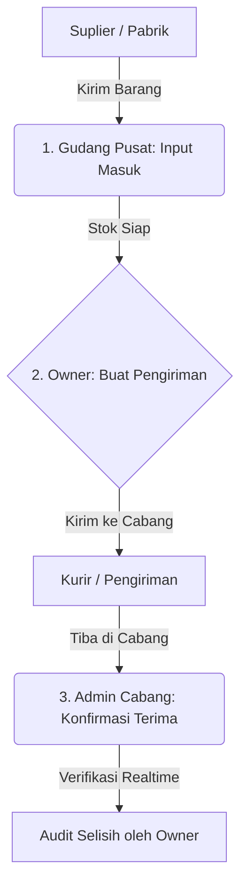

# Panduan Pengguna: Sistem Manajemen Stok RedBox Stockist

Aplikasi **RedBox Stockist** dirancang khusus untuk mengelola inventaris produk barbershop secara terpusat, memantau pergerakan barang antar cabang, serta meminimalisir selisih stok (discrepancy). 

---

## 🔑 Akses Masuk Aplikasi
- **Domain Web**: `https://admin.redboxbarbershop.com/admin/stockist`
- **Aplikasi Mobile (APK)**: Langsung buka aplikasi **RedBox Stockist** di handphone Anda.
- **Akun**: Gunakan Email dan Password yang didaftarkan sebagai **Owner** atau **Branch Admin (Kasir/Admin Cabang)**.

---

## 📋 Alur & Peran Pengguna (Role Flow)

Sistem membagi tugas menjadi 3 peran utama dengan visualisasi dashboard yang disesuaikan demi keamanan data:

---

## 1. Peran: OWNER (Pemilik / Superadmin)
Owner bertugas memantau seluruh ekosistem produk secara realtime dan memegang kendali penuh atas mutasi stok.

### A. Memantau Stok Seluruh Cabang secara Realtime
1. Di **Beranda (Dashboard)**, Anda akan melihat total stok keseluruhan (`Total Pcs Fisik`) di seluruh jaringan RedBox.
2. Perhatikan bagian **Peringatan Stok Menipis** (berwarna kuning/merah). Sistem menyortir otomatis produk yang jumlahnya berada di bawah limit minimum cabang.
3. Anda dapat masuk ke menu **Stok Cabang**, lalu memilih dropdown cabang (misal: *Bypass*, *CSB Mall*, *Tegal*) untuk memantau inventaris spesifik di cabang tersebut detik itu juga.

### B. Mendaftarkan Produk Baru (Master Data)
1. Buka menu **Produk** (ikon keranjang belanja).
2. Klik tombol **Tambah Produk Baru** di pojok kanan atas.
3. Isi formulir lengkap:
   - **SKU**: Kode unik produk (contoh: `RBX-POM-C100`).
   - **Nama Produk**: Nama resmi (contoh: `Pomade Classic RedBox 100g`).
   - **Kategori**: Pilih atau ketik kategori produk (contoh: `Pomade`).
   - **Satuan**: Satuan hitung (contoh: `pcs` atau `btl`).
   - **Harga Retail**: Harga jual ke pelanggan.
   - **Limit Minimum**: Batas stok menipis (sistem akan memberi peringatan jika stok di bawah angka ini).
4. Klik **Simpan Produk**. Produk baru akan langsung terdaftar di sistem.

### C. Mengirim Barang ke Cabang (Stock Transfer)
1. Buka menu **Transfer** (ikon kertas riwayat).
2. Klik **Buat Transfer** di pojok kanan atas.
3. Pada halaman pembuatan:
   - **Lokasi Asal**: Otomatis terset ke **Gudang Utama (Pusat)**.
   - **Cabang Tujuan**: Pilih cabang yang meminta barang (misal: *Bypass*).
4. Pilih produk yang ingin dikirim pada dropdown **Detail Produk**, lalu masukkan jumlahnya (**Qty**).
5. Klik **+ Tambah Produk Baru** jika ingin mengirim lebih dari satu jenis produk dalam satu pengiriman.
6. Klik **Kirim Transfer Stok**. Status transaksi akan tercatat sebagai **DIKIRIM (SENT)** secara realtime.

---

## 2. Peran: ADMIN GUDANG PUSAT (Penerimaan Barang Masuk)
Admin Gudang Pusat bertanggung jawab menginput barang yang baru datang dari suplier/pabrik ke dalam penyimpanan utama (Gudang Utama).

### A. Input Barang Masuk ke Gudang Utama
1. Buka menu **Terima** (ikon gudang).
2. Anda akan melihat ringkasan stok Gudang Utama saat ini.
3. Klik tombol **Terima Barang Masuk** di kanan atas.
4. Isi modal input:
   - **Pilih Produk**: Cari produk yang baru datang.
   - **Jumlah Masuk (Pcs)**: Jumlah fisik barang yang dimasukkan ke rak gudang.
   - **Catatan**: Keterangan tambahan (contoh: `Restock dari Suplier PT. Kinarya`).
5. Klik **Konfirmasi Simpan**. Stok Gudang Utama akan langsung bertambah secara realtime dan tercatat di buku besar ledger.

---

## 3. Peran: ADMIN CABANG / KASIR (Penerimaan di Cabang)
Admin Cabang bertanggung jawab memantau stok tokonya sendiri serta memverifikasi fisik barang yang dikirim dari Gudang Pusat.

### A. Memeriksa Stok Toko Sendiri
1. Di **Beranda**, Admin Cabang disajikan ringkasan stok toko mereka beserta indikator peringatan jika ada item yang habis.
2. Menu **Stok Saya** menampilkan seluruh katalog produk aktif beserta sisa jumlah yang ada di etalase mereka.

### B. Menerima & Mengonfirmasi Barang Kiriman (Stock Receipt)
Ketika kurir/barang dari Gudang Pusat tiba di cabang:
1. Buka menu **Transfer** di bilah bawah.
2. Anda akan melihat kartu transaksi berstatus **Dikirim** dengan warna merah. Klik kartu tersebut untuk membuka detailnya.
3. Di halaman detail, hitung fisik barang yang Anda terima secara manual:
   - Bandingkan jumlah fisik dengan angka di kolom **Dikirim**.
   - Input jumlah fisik yang benar-benar Anda terima pada kotak input **Diterima**.
4. **Penanganan Selisih (Discrepancy)**: 
   - Jika barang yang dikirim 50 pcs, tetapi setelah dihitung fisik hanya ada 48 pcs, ketik `48` di kolom input.
   - Sistem akan otomatis menghitung selisih (`-2`) dan menyimpannya sebagai catatan audit untuk Owner.
5. Klik tombol **Konfirmasi Terima Barang**. Status transaksi berubah menjadi **DITERIMA (RECEIVED)**. Stok cabang Anda akan langsung bertambah secara otomatis.

---

> [!IMPORTANT]
> **Catatan Audit Realtime**:
> Setiap kali Admin Cabang menekan tombol *Konfirmasi Terima Barang*, seluruh perubahan stok dan selisih pengiriman akan langsung tersinkronisasi ke dashboard **Owner**. Owner dapat langsung mendeteksi selisih pengiriman tanpa perlu menunggu laporan manual bulanan.
