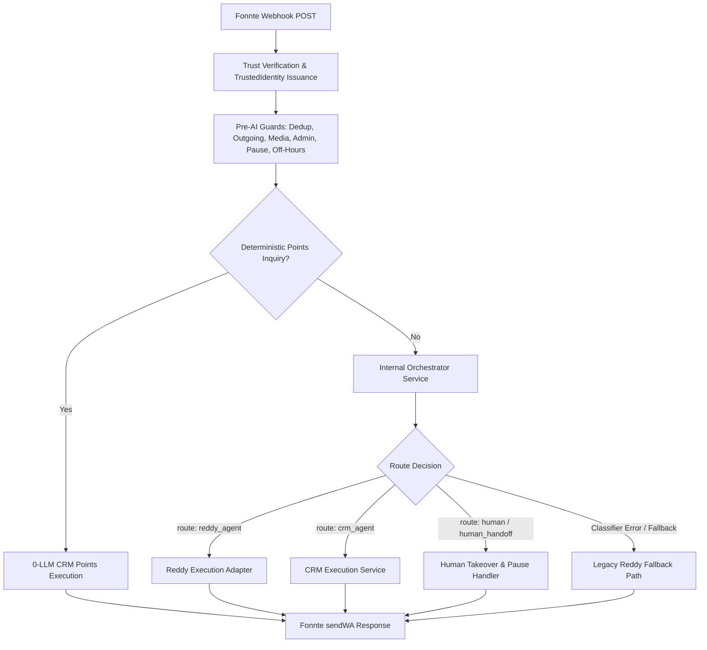

# REDBOX AI — TASK 10 DESIGN SPECIFICATION
## Orchestrator → Reddy Integration (Plan B — Reddy Intelligence Core)
**Date**: 2026-08-26  
**Status**: APPROVED DESIGN SPECIFICATION  
**Target Module**: AI Orchestrator v0.2 + Reddy Agent Integration  

---

### 1. Current Live Flow Audit

In production baseline `main`:
1. **Fonnte Webhook Entry** (`POST /api/wa/webhook`):
   - Coerces & parses raw Fonnte JSON payload.
   - Evaluates `verifyRedboxWebhookTrustQuery(req.query, body)` for provider-native `webhook-secret-key` trust.
   - Issues `issueAuthenticatedWhatsappEvent(trust, body)` and adapts to capability-backed `TrustedIdentity`.
2. **Pre-AI Guards**:
   - Message deduplication check (`isDuplicate(id)`).
   - Outgoing message check (`isFromMe` $\rightarrow$ sets local & Supabase human takeover if admin manual reply).
   - Cross-branch loop check (`BRANCH_WA_NORMALIZED` sender rejection).
   - Media message filter (`image`, `video`, `audio`, etc. return polite warning).
   - Admin slash commands (`/ai_on`, `/ai_off`, `/ai_status`, `/ai_help`).
   - Human Takeover check (`isHumanTakeover(sender)` $\rightarrow$ pauses AI if admin takeover active).
   - Branch off-hours check (`isBranchAiOff(branch)` $\rightarrow$ silences AI outside operational hours).
3. **`handleMessage` Processing**:
   - **Deterministic Points Inquiry**: Evaluates `classifyDeterministically(text)`. If `intent === 'points_inquiry'`, directly calls `executionService.executeOrchestration` with `crm_agent` `get_points` tool (0 LLM, 100% deterministic).
   - **Foreign Language Intercept**: Checks `isForeignLanguage(text)` or active session.
   - **Fast Keyword Policies**: Intercepts `isHomeService`, `isWedding`, `isOtw`, `isWalkIn`, services/pricing lists, wait time complaints.
   - **Default AI Path**: Invokes `callOpenAI(from, text, name, branch)` using `gpt-4o-mini` with per-user conversation memory.
   - **Fonnte Reply**: Sends response via `sendWA(from, reply, { branch })`.

---

### 2. Target Architecture & Flow

#### Detailed Step-by-Step Flow:
1. **Webhook Ingestion**: `/api/wa/webhook` handles incoming HTTP POST.
2. **Trust & Identity**: Validates body-secret trust, issues capability-backed `TrustedIdentity`.
3. **Guards & Policy**: Deduplication, media filter, admin commands, human takeover (`wa_paused`), branch off-hours.
4. **`handleMessage` Orchestration**:
   - **Step A — Deterministic Shortcut**: If `classifyDeterministically(text)` yields `points_inquiry`, execute CRM points path directly without calling Orchestrator LLM (0 LLM cost).
   - **Step B — Internal Orchestrator Call**: Invoke `orchestrateMessage({ message: text, channel: 'whatsapp', branch, trustedIdentity })` in-process.
   - **Step C — Route Evaluation**:
     - `route: 'reddy_agent'`: Invoke Reddy Execution Adapter (`executeReddyAgent`).
     - `route: 'crm_agent'`: If `action === 'get_points'`, execute CRM points via `executionService.executeOrchestration`. If unauthorized/unauthenticated, return secure advice message.
     - `route: 'human'` or `human_handoff`: Pause AI conversation / trigger human handoff response. DO NOT invoke Reddy LLM.
     - **Failure / Unsupported / Low Confidence**: If Orchestrator throws, times out, returns malformed JSON, or returns an unknown route, fall back to safe legacy Reddy path.
5. **Fonnte Delivery**: Send generated response through `sendWA(from, reply, { branch })`.

---

### 3. Component Boundaries (LOCKED)

Phase 1 contains **ONLY THREE AI COMPONENTS**:
1. `orchestrator`: Decides **WHAT** should happen (intent, route, agent, action, confidence, model_tier). Returning routing decisions ONLY. Does NOT generate customer-facing text, prices, or FAQ copy.
2. `reddy_agent`: Decides **HOW** to communicate the answer (customer-facing conversational layer powered by OpenAI `gpt-4o-mini`).
3. `crm_agent`: Provides factual customer data via 0-LLM deterministic read operations over `Customer360`.

`human_handoff` is a routing outcome/state, NOT an AI agent. No `booking_agent`, `membership_agent`, `support_agent`, or `branch_agent` shall be created.

---

### 4. Trust & Security Boundaries
- `TrustedIdentity` is capability-based (backed by module-private WeakSet).
- Identity verification occurs BEFORE orchestration.
- Caller text cannot alter `trustedIdentity`, `phone`, or `customer_id`.
- Orchestrator receives pseudonymous routing context only (no raw phone, no raw secrets, no full customer profile).
- No IDOR vulnerabilities or unauthenticated data leakage.

---

### 5. Fallback & Availability Semantics

| Scenario | Primary Decision | Fallback Action | Security / State Rule |
| :--- | :--- | :--- | :--- |
| **Normal Conversational Message** | `route: reddy_agent` | Execute Reddy Agent | Allowed |
| **Points Inquiry (Deterministic)** | `route: crm_agent` (`get_points`) | Execute CRM Points | Requires `TrustedIdentity` |
| **Orchestrator Throws / Timeout** | Error / Timeout | Fallback to Legacy Reddy | Allowed for general questions; blocked for private data |
| **Malformed Orchestrator Output** | Unparseable JSON | Fallback to Legacy Reddy | Allowed for general questions |
| **Unsupported Agent / Route** | Unknown Route | Fallback to Legacy Reddy | Allowed for general questions |
| **`human_handoff` Intent** | `route: human` | Trigger Handoff & Pause | **MUST NOT** execute Reddy LLM |
| **`wa_paused` Active Session** | Paused Session | Suppress AI Response | **MUST NOT** execute Orchestrator or Reddy |
| **Unauthenticated Private Request** | `crm_agent` without Trust | Return Security Advice | **MUST NOT** fall back to Reddy to leak data |

---

### 6. Human Handoff Semantics
- When Orchestrator returns `intent: 'human_request'` / `intent: 'complaint'` / `route: 'human'`:
  - Flag conversation as human takeover (`setHumanTakeoverLocal` & `persistHumanTakeover`).
  - Send friendly handoff acknowledgement ("Pesan Kakak sudah diteruskan ke admin cabang...").
  - Do NOT execute Reddy LLM conversation generation.

---

### 7. Telemetry & Observability
Safe structured telemetry logging (`server/orchestrator/telemetry.js`):
- **Allowed Fields**: `route`, `agent`, `intent`, `action`, `confidence_bucket`, `model_tier`, `fallback_used`, `fallback_reason`, `latency_ms`, `branch`, `trust_status`, `event_type`.
- **Forbidden Fields (PII Leak Prevention)**: `raw_phone`, `raw_secret`, `customer_name`, `customer_id`, `message_text`, `openai_raw_response`, `crm_records`, `transcripts`.

---

### 8. Cost & Call Constraints
- **Max Orchestrator Calls**: 1 classification call per eligible message.
- **Max Reddy Calls**: 1 generation call per normal response.
- **Points Inquiry**: 0 LLM retrieval (deterministic classifier shortcut).
- **No Automatic Retries**: 0 retries on classifier failure; fall back immediately.

---

### 9. Explicit Out-of-Scope Items
- Task 11 (deep CRM personalization beyond existing points flow).
- Task 12 (conversation intelligence redesign).
- Task 13 (knowledge architecture redesign).
- Database migration / DDL modifications.
- Creation of new autonomous AI agents.
